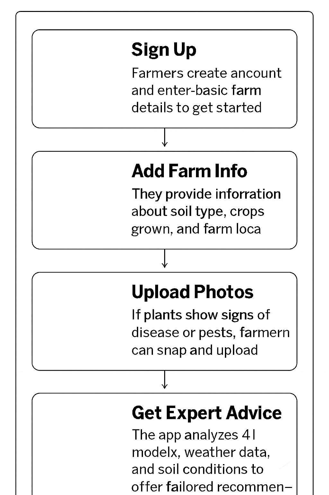

# Smart India Hackathon Workshop
# Date:29.09.2025
## Register Number:25013444
## Name:Vivek Christo A
## Problem Title
SIH 25010: Smart Crop Advisory System for Small and Marginal Farmers
## Problem Description
A majority of small and marginal farmers in India rely on traditional knowledge, local shopkeepers, or guesswork for crop selection, pest control, and fertilizer use. They lack access to personalized, real-time advisory services that account for soil type, weather conditions, and crop history. This often leads to poor yield, excessive input costs, and environmental degradation due to overuse of chemicals. Language barriers, low digital literacy, and absence of localized tools further limit their access to modern agri-tech resources.

Impact / Why this problem needs to be solved

Helping small farmers make informed decisions can significantly increase productivity, reduce costs, and improve livelihoods. It also contributes to sustainable farming practices, food security, and environmental conservation. A smart advisory solution can empower farmers with scientific insights in their native language and reduce dependency on unreliable third-party advice.

Expected Outcomes

• A multilingual, AI-based mobile app or chatbot that provides real-time, location-specific crop advisory.
• Soil health recommendations and fertilizer guidance.
• Weather-based alerts and predictive insights.
• Pest/disease detection via image uploads.
• Market price tracking.
• Voice support for low-literate users.
• Feedback and usage data collection for continuous improvement.

Relevant Stakeholders / Beneficiaries

• Small and marginal farmers
• Agricultural extension officers
• Government agriculture departments
• NGOs and cooperatives
• Agri-tech startups

Supporting Data

• 86% of Indian farmers are small or marginal (NABARD Report, 2022).
• Studies show ICT-based advisories can increase crop yield by 20–30%.

## Problem Creater's Organization
Government of Punjab

## Theme
Agriculture, FoodTech & Rural Development

## Proposed Solution

<ul><li>The solution is to make a mobile app and chatbot that helps farmers by giving them advice in their own language The app will tell the farmers which crop to grow what fertilizer to use and how to control pests based on the soil and weather Farmers can also upload photos of sick plants to find out the problem. The app will give alerts about rain or heat, and it will also show market prices so farmers can sell at the right time Even farmers who cannot read well can use the app through voice chat This will make farming easier, cheaper, and more profitable for small farmers.</li></ul>

## Technical Approach

<ul><li>The app will be made using programming languages like Python and Java for mobile phones It will use AI (Artificial Intelligence) and Machine Learning to check plant diseases from photos and to give advices Weather information and soil data will be added through online services (APIs) Cloud platforms like AWS or Google Cloud will be used to store and manage farmer data safely The app will also have voice and text support in local languages using speech and translation tools. Farmers can use it online but it will also work offline and update when the internet is available.
</li>
<li>Sign Up: Farmers create an account on the app and enter basic farm details.

Add Farm Info: They provide information about their soil, crops, and location.

Upload Photos: Farmers can take pictures of plants if they notice disease or pests.

Get Advice: The app uses AI, weather data, and soil information to give advice on crops, fertilizers, and pest control.

Alerts & Updates: Farmers receive weather alerts, market prices, and reminders for farm activities.

Voice & Text Support: Advice is given in local languages through text and voice, so even farmers who cannot read can use it.

Feedback Loop: Farmers can give feedback, which helps the app improve its advice over time.</li></ul>

## Feasibility and Viability

<ul><li>This idea is possible because most farmers today have access to smartphones and mobile networks Government and private groups are also supporting new farming technologies which makes it easier to introduce this app AI and language tools are already available, so they can be used to give advice in local languages Since weather data, soil reports, and market prices are available online, the app can collect and share this information with farmers. With the right planning and training, the solution can be developed and used in real life.</li>
<li>Some villages may not have good internet which can make it hard to get real-time advice. Farmers speak many different languages  so giving accurate voice and text support can be difficult. Training AI to correctly identify crop diseases from photos may take time and large amounts of data Some farmers may also hesitate to trust a mobile app instead of local advice.</li>
<li>The app can work offline so farmers can still use it without internet, and the data can update whenever the phone gets a signal For languages, the app can use simple voice and translation tools and work with local experts to make it accurate To train the AI, many photos of crops and diseases can be collected with help from agricultural colleges and research centers To build the trust, the app can be introduced through government programs, local officers, and NGOs so farmers feel confident using it.</li></ul>

## Impact and Benefits

<ul><li>This app can help farmers make better decisions about crops, fertilizers, and pest control, which will increase their harvest and reduce extra costs. Farmers will feel more confident because they get clear advice in their own language and even by voice if they cannot read. They will depend less on guesswork or middlemen and instead use scientific advice. Over time, this can improve their income, reduce stress, and make farming more sustainable for future generations</li>
<li>This solution will help farmers get advice in their own language, making them more confident and independent. It will save money by reducing extra use of fertilizers and pesticides, improve crop yield, and give better market awareness for higher income. At the same time, it will protect the soil, water, and environment by promoting smart and careful farming practices. Overall, it will make farming easier, more profitable, and sustainable for small and marginal farmers.</li></ul>

## Research and References

<ul><li>FAO Report on ICT in Agriculture
Link: https://www.fao.org/3/i3144e/i3144e.pdf

Explains how information and communication technology (ICT) can increase crop yield and help farmers make better decisions.

AI in Crop Disease Detection Research Paper
Link: https://www.sciencedirect.com/science/article/pii/S0168169919303951

Describes how AI and image recognition can detect crop diseases effectively.

Weather-based Advisory Systems for Farmers
Link: https://www.researchgate.net/publication/337862362

Shows how weather alerts help farmers plan irrigation, planting, and harvesting</li></ul>
